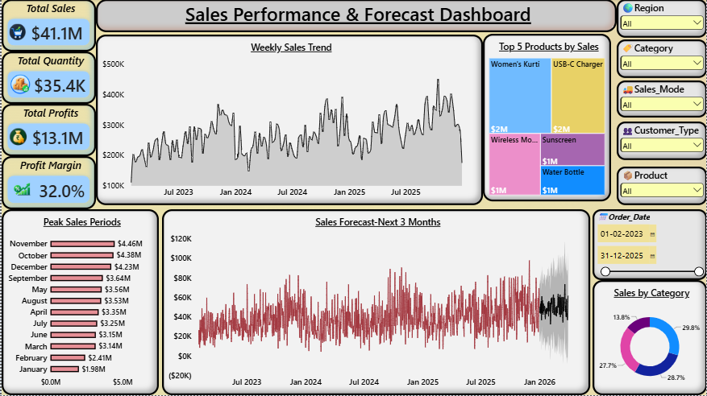

# Sales Forecasting & Demand Prediction Analysis

## About the Project

This is a Data Analytics project based on retail sales data.

The main purpose of this project is to understand sales performance, find sales trends and seasonal patterns, and predict future sales. The analysis can help a business improve inventory planning and make better decisions.

## Tools Used

- Microsoft Excel
- Power BI
- DAX

## What I Did in This Project

- Cleaned and prepared the sales data
- Checked sales performance over time
- Analyzed weekly and monthly sales trends
- Identified peak sales months
- Analyzed product and category performance
- Studied seasonal sales patterns
- Created a basic sales forecast
- Built an interactive Power BI dashboard
- Added slicers for interactive analysis
- Created business insights and recommendations

## Dashboard

The dashboard shows:

- Total Sales
- Total Quantity
- Total Profit
- Profit Margin
- Weekly Sales Trend
- Top 5 Products by Sales
- Peak Sales Periods
- Sales Forecast for the Next 3 Months
- Sales by Category
- Region, Category, Sales Mode, Customer Type and Product filters

## Key Insights

- November had the highest sales.
- October and December were also strong sales months.
- Sales were higher during the end of the year.
- January and February had comparatively lower sales.
- Overall sales showed an increasing trend.
- Top-selling products are expected to have good future demand.

## Business Recommendations

- Keep more inventory before October, November and December.
- Focus more on products with high sales.
- Use sales forecasting for inventory planning.
- Monitor sales performance regularly.
- Avoid keeping too much stock of low-demand products.

## Project Outcome

This project helped me improve my practical skills in:

- Data Cleaning
- Excel
- Power BI
- DAX
- Data Visualization
- Sales Analysis
- Trend Analysis
- Forecasting
- Business Intelligence

## Project Files

- `retail_sales_raw_data.csv` – Raw dataset
- `retail_sales_clean_data.xlsx` – Cleaned dataset
- `Sales_Forecasting_Dashboard.pbix` – Power BI dashboard
- `Dashboard.png` – Dashboard screenshot

## Project Title

**Sales Forecasting & Demand Prediction Analysis**

**Role:** Data Analyst  
**Tools:** Excel, Power BI, DAX
